# User Journey Flow - Learning Analytics Microservice

**Version:** 2.0  
**Date:** October 24, 2025  
**Status:** Design Complete  
**Purpose:** Visual representation of all user flows through the application  

---

## 📋 **Table of Contents**

1. [High-Level User Journey](#high-level-user-journey)
2. [Authentication Flow](#authentication-flow)
3. [Multi-Role User Flow](#multi-role-user-flow)
4. [Learner Journey](#learner-journey)
5. [Trainer Journey](#trainer-journey)
6. [Organization Admin Journey](#organization-admin-journey)
7. [Comparison Analytics Flow](#comparison-analytics-flow)
8. [Error Handling Flows](#error-handling-flows)

---

## 🗺️ **High-Level User Journey**

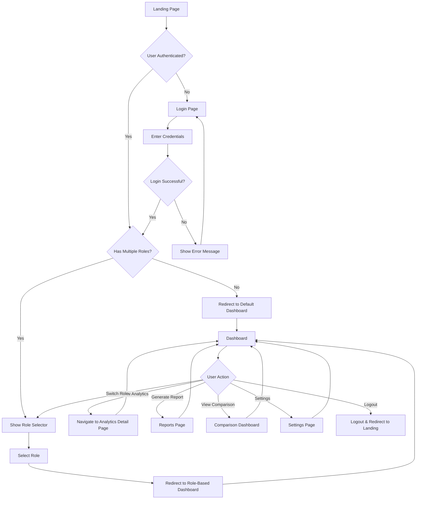

---

## 🔐 **Authentication Flow**

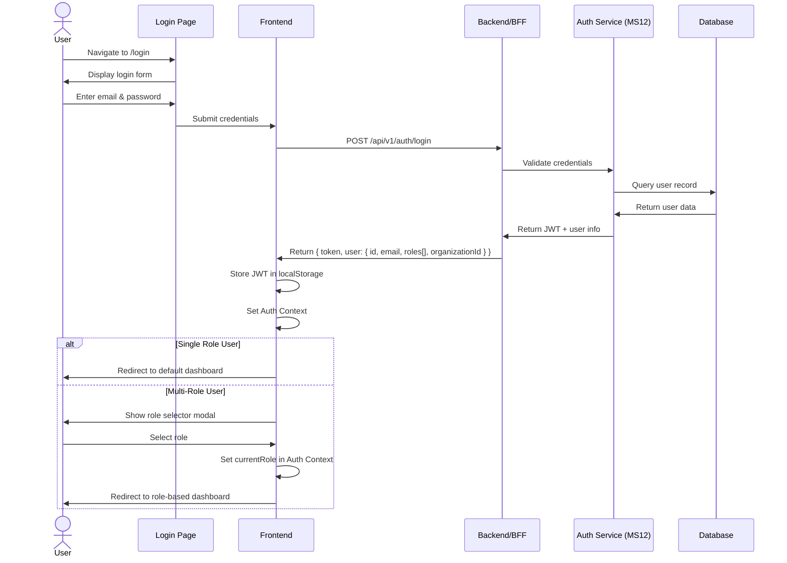

---

## 👥 **Multi-Role User Flow**

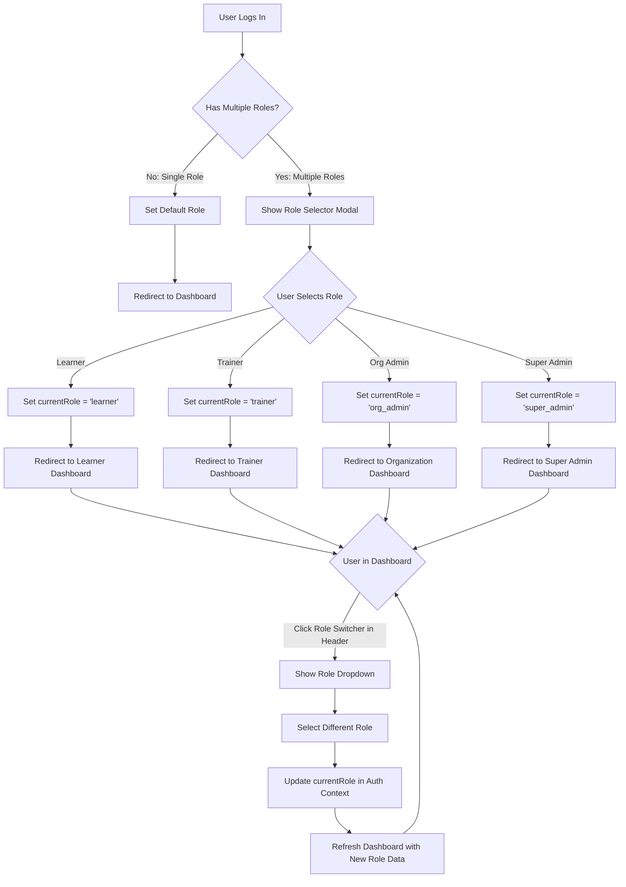

---

## 🎓 **Learner Journey**

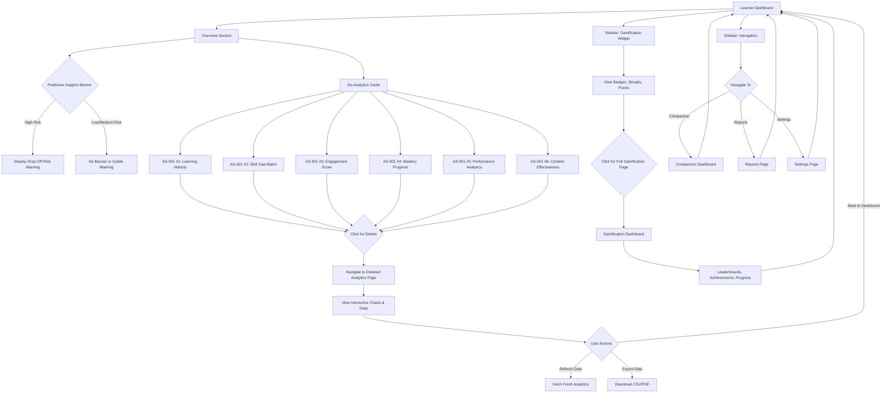

---

## 👨‍🏫 **Trainer Journey**

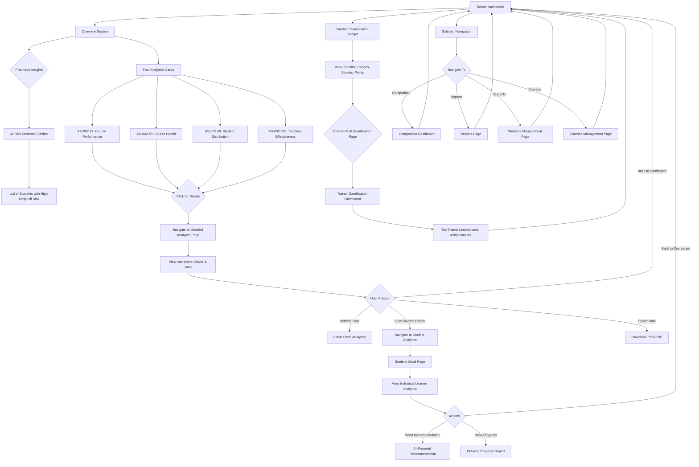

---

## 🏢 **Organization Admin Journey**

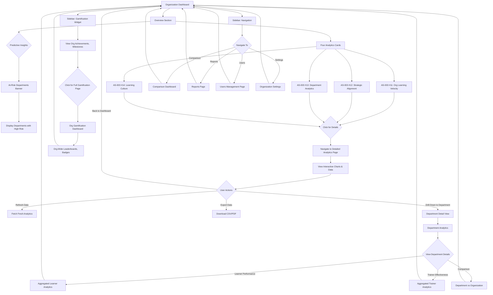

---

## 📊 **Comparison Analytics Flow**

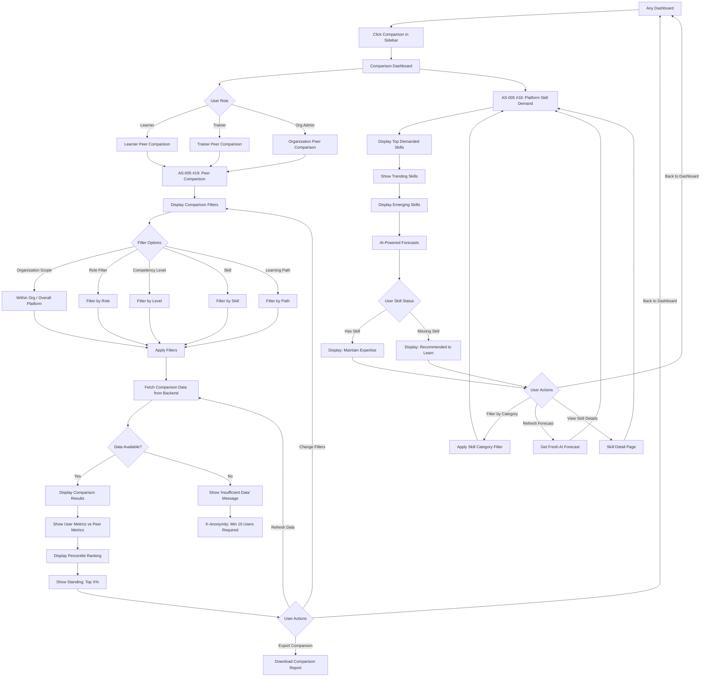

---

## ⚠️ **Error Handling Flows**

### **Network Error Flow**

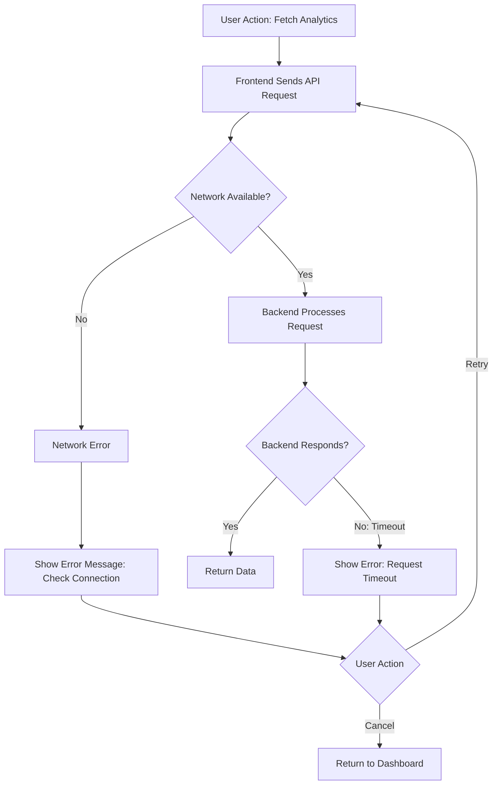

### **Authentication Error Flow**

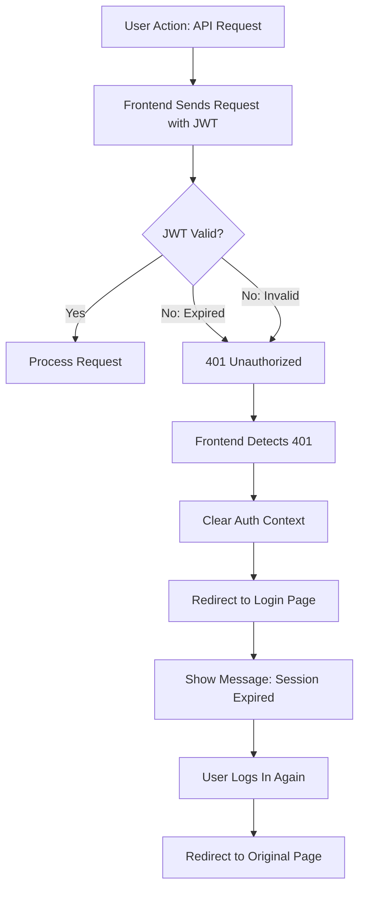

### **Authorization Error Flow**

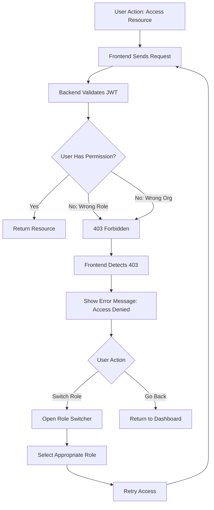

### **Data Not Available Flow**

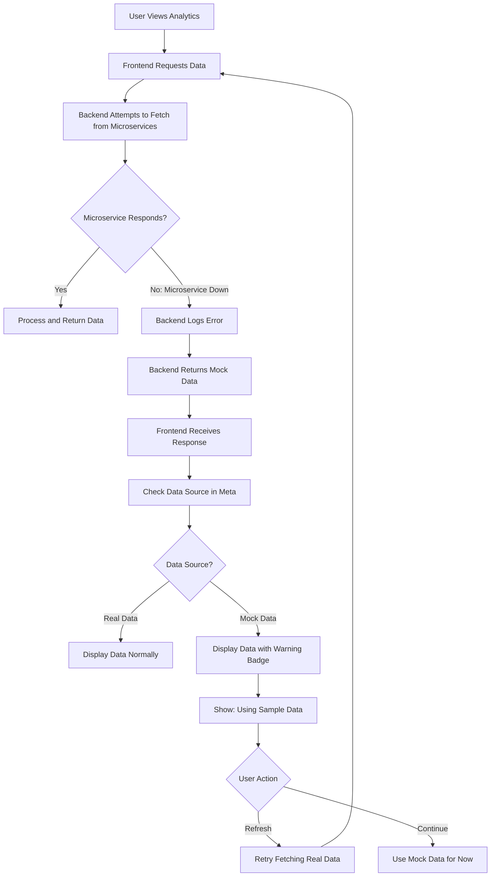

### **K-Anonymity Error Flow (Comparison Analytics)**

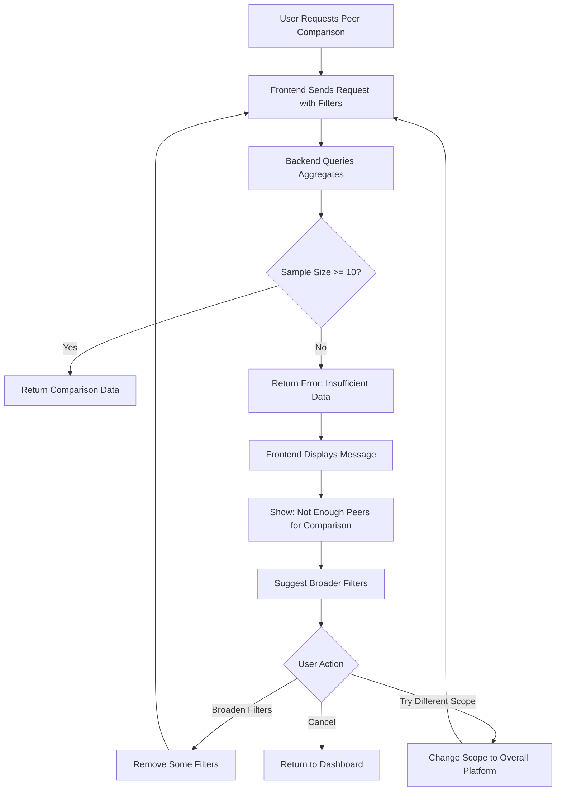

---

## 📋 **User Journey Summary**

### **Entry Points**
1. **Landing Page** → Login → Dashboard
2. **Direct Link** → Login (if not authenticated) → Redirect to original URL

### **Main Flows**
1. **Authentication** → Role Selection (if multi-role) → Dashboard
2. **Dashboard Overview** → Analytics Cards → Detailed Analytics Pages
3. **Navigation** → Comparison / Reports / Settings / Users
4. **Role Switching** → Update Context → Refresh Dashboard

### **Success Paths**
- User successfully logs in and views their analytics
- User navigates between different analytics sections
- User generates and exports reports
- User compares performance with peers

### **Alternative Paths**
- User with multiple roles switches between role dashboards
- User refreshes analytics data manually
- User accesses gamification features

### **Error Paths**
- Network errors → Retry mechanism
- Authentication errors → Redirect to login
- Authorization errors → Role switcher or access denied message
- Data unavailable → Mock data fallback
- K-anonymity violation → Suggest broader filters

---

## 🎯 **Design Principles**

1. **Progressive Disclosure**
   - Show overview first, details on demand
   - Predictive insights as subtle banners (not intrusive)

2. **Error Recovery**
   - Clear error messages with actionable suggestions
   - Automatic retry for transient failures
   - Graceful degradation with mock data

3. **Accessibility**
   - Keyboard navigation support
   - Screen reader friendly
   - Focus management

4. **Performance**
   - Lazy load detailed pages
   - Cache analytics data (SWR)
   - Skeleton loading states

5. **User Empowerment**
   - Manual refresh option
   - Filter controls for comparison
   - Export capabilities

---

**Document Version:** 2.0  
**Last Updated:** October 24, 2025  
**Status:** ✅ Complete  
**Next Document:** `backend_architecture.md`

